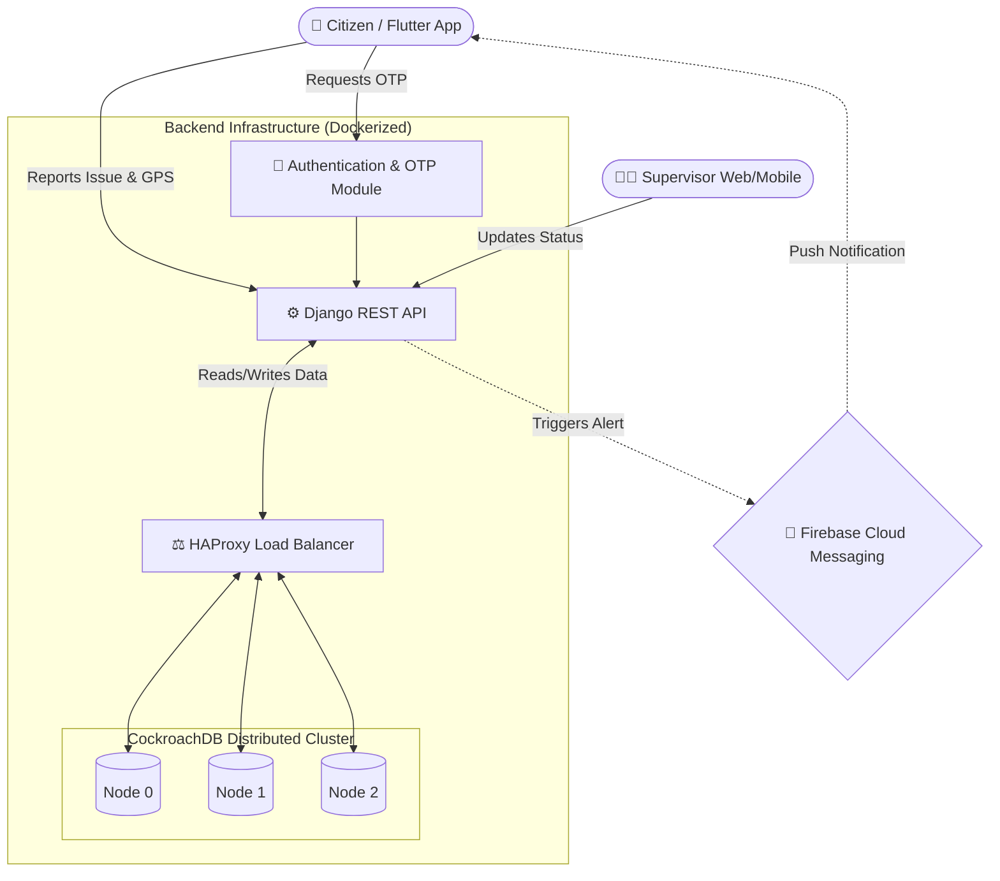
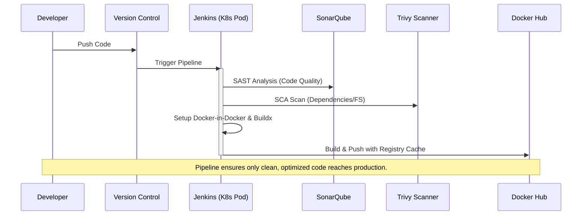

<div align="center">

<pre>
  _____         _      _          
 |_   _|       (_)    | |         
   | | __ _ ___ _  ___| | ___   _ 
   | |/ _` / __| |/ _ \ |/ / | | |
   | | (_| \__ \ |  __/   <| |_| |
   \_/\__,_|___/_|\___|_|\_\\__, |
                             __/ |
                            |___/ 
</pre>

# 🛣️ Tarieky (طريقي) - Empowering Citizens, Transforming Cities.

[]()
[]()
[]()
[]()
[]()

*An Advanced Graduation Project redefining civic engagement and urban maintenance through scalable technology.*

---

</div>

## 🌌 The Vision & Mission

In rapidly growing cities, infrastructure maintenance can't rely solely on manual patrols. **Tarieky (طريقي)** shifts the paradigm by crowd-sourcing urban oversight. We equip every citizen with a digital megaphone to report potholes, broken streetlights, missing signs, and road hazards instantly. 

By routing these reports directly to the relevant local authorities (Supervisors) based on precise geographic data, Tarieky cuts through red tape, accelerates repairs, and ultimately saves lives.

---

## 🏗️ System Architecture

Our architecture is built for **resilience, high availability, and rapid scaling**. Here is a bird's-eye view of how the system components interact:



---

## 🔍 Deep Dive: How It Works

### 1. The Citizen Experience (Frontend)
- **Frictionless Onboarding:** Users sign up using a secure **OTP (One Time Password)** sent to their email. 
- **Context-Rich Reporting:** When a user spots an issue, they take a photo. The app captures the image, categorizes the issue (e.g., `lighting`, `pothole`, `road_damage`), and attaches exact `latitude` and `longitude` coordinates.
- **The Notification Loop:** We integrated **Firebase (FCM)** to keep citizens informed. Users receive real-time push notifications when their report is viewed, accepted, or resolved.

### 2. The Supervisor Command Center
- **Geo-Fenced Authority:** Every supervisor is assigned to a specific `governorate` and `city`. They only see and manage issues within their jurisdiction.
- **Workflow Management:** Supervisors transition issues through a strict lifecycle: `Pending` ➡️ `In Progress` ➡️ `Resolved` (or `Rejected`).

### 3. The Distributed Database Cluster
Instead of a traditional single-node database, we implemented a **CockroachDB Cluster**:
- **3-Node Setup:** Data is replicated across three separate nodes (`db-0`, `db-1`, `db-2`).
- **HAProxy Load Balancing:** All API queries are routed through HAProxy on port `26257`, which intelligently distributes the load across the database nodes.
- **Why?** If one database node crashes, the system remains 100% operational with zero data loss.

---

## 🛡️ Enterprise-Grade DevOps & CI/CD

We didn't just build an app; we built an automated, self-checking pipeline. Our Jenkins CI/CD pipeline runs dynamically on **Kubernetes Pods** and ensures code quality before a single container is deployed.



### CI/CD Highlights:
- **SonarQube (SAST):** Scans the Python codebase for bugs, code smells, and security vulnerabilities.
- **Trivy (SCA):** Scans the repository filesystem for known CVEs (Common Vulnerabilities and Exposures) before building the image.
- **Docker Buildx:** Utilizes `--cache-from` and `--cache-to` with a remote Docker registry. This means subsequent builds only compile changed layers, dropping build times from minutes to seconds.

---

## 🚀 Lift Off! (Installation & Setup)

Experience the backend cluster locally with a single command. 

### Prerequisites
- Docker & Docker Compose
- Git

### The Ignition Sequence
```bash
# 1. Clone the core repository
git clone <your-repo-url>
cd tarieky

# 2. Spin up the distributed environment
docker-compose up --build -d
```

**What happens next?**
1. Docker spins up the `db-init` container to bootstrap the CockroachDB cluster.
2. The 3 database nodes establish quorum.
3. HAProxy begins balancing database traffic.
4. The Django Gunicorn server starts on `http://localhost:8000`.

---

## 🎓 About This Graduation Project

Tarieky is the culmination of our academic journey. It bridges the gap between theoretical computer science and practical, production-ready software engineering. 

By integrating **mobile development**, **geospatial data**, **distributed database clustering**, and **advanced CI/CD pipelines**, this project demonstrates our readiness to tackle complex, real-world challenges in the tech industry.

<div align="center">
  <br>
  <b>Engineered to make a difference. Designed to save lives.</b><br>
  <i>Built with ❤️ by the Tarieky Team</i>
</div>
